`INDIA` · `SHIPS ON THE EDGE` · `PRIVACY BY DEFAULT` · `SOURCE PRIVATE`

## `>` WHOAMI

I build tools that do the work **on your device** — not on a server that logs it.
Browser-side image and PDF pipelines, on-device semantic search, epidemic models
you can actually audit. If it can run locally, it should.

The source is private. The work is not — everything below is live and open in
your browser right now, no account required.

| | PROJECT | WHAT IT DOES | STACK |
|:-:|:--|:--|:--|
| `[>]` | **[THE EDITORS](https://the-editors.vercel.app)** | Image + document tools that never upload. Compress to an exact file size, passport photos to the millimetre, merge PDFs — offline-capable. | `TypeScript` |
| `[>]` | **[MERIDIAN](https://meridian-andrin.vercel.app)** | A personal wire service. Folds each story into one card showing which newsrooms carry it and how they're funded. Meaning-based search runs on your device. | `JavaScript` |
| `[>]` | **[RAPHAVISION](https://raphavision.vercel.app)** | Epidemic intelligence — SIR · SEIR · SEIRD · SEIRDV models, live surveillance, WIS-validated forecasting with per-figure uncertainty labelling. | `Python` |
| `[>]` | **[SDG 17 HUB](https://sdg17-studaifoundery.vercel.app)** | Interactive hub for UN SDG 17 — how partnerships in finance, technology, skills, trade and policy move the needle. All figures in INR. | `TypeScript` |

## `>` STACK

## `>` CONNECT

