<div align="center">



<br>

`INDIA` · `BUILDS IN THE OPEN, SHIPS ON THE EDGE` · `PRIVACY BY DEFAULT`

</div>

---

```
┌────────────────────────────────────────────────────────────────────┐
│  ANDRIN GODSON // SYSTEM 0x01                         LOC: INDIA   │
├────────────────────────────────────────────────────────────────────┤
│  POST ............................................... OK           │
│  MEMORY CHECK ....................................... 640K OK      │
│  LOADING PROFILE .................................... DONE         │
│  PRIVACY MODE ....................................... ENABLED      │
│  LIVE DEPLOYMENTS ................................... 4 ONLINE     │
│                                                                    │
│  READY.                                                            │
│  _                                                                 │
└────────────────────────────────────────────────────────────────────┘
```

## `>` WHOAMI

I build tools that do the work **on your device** — not on a server that
logs it. Browser-side image and PDF pipelines, on-device semantic search,
epidemic models you can actually audit. If it can run locally, it should.

Most of my source is private. The work itself is not — every project below
is live and open in your browser right now, no account required.

## `>` DIR /LIVE

```
Volume in drive A is PROJECTS
Directory of A:\LIVE
```

| | PROJECT | WHAT IT DOES | STACK |
|:-:|:--|:--|:--|
| `[>]` | **[THE EDITORS](https://the-editors.vercel.app)** | Image + document tools that never upload. Compress to an exact file size, passport photos to the millimetre, merge PDFs — offline-capable. | `TypeScript` |
| `[>]` | **[MERIDIAN](https://meridian-andrin.vercel.app)** | A personal wire service. Folds each story into one card showing which newsrooms carry it and how they're funded. Meaning-based search runs on your device. | `JavaScript` |
| `[>]` | **[RAPHAVISION](https://raphavision.vercel.app)** | Epidemic intelligence — SIR · SEIR · SEIRD · SEIRDV models, live surveillance, WIS-validated forecasting with per-figure uncertainty labelling. | `Python` |
| `[>]` | **[SDG 17 HUB](https://sdg17-studaifoundery.vercel.app)** | Interactive hub for UN SDG 17 — how partnerships in finance, technology, skills, trade and policy move the needle. All figures in INR. | `TypeScript` |

## `>` DIR /LAB

```
Directory of A:\LAB                                    [SOURCE: PRIVATE]
```

```
AURALIS.EXE     Multilingual code-switching voice assistant for Indian
                public services. DataForge 2026, Rime track.        [TS]

THREATML.EXE    ML model that analyses network data traffic.        [PY]

NEXUS.EXE       The Analyser.                                       [JS]

ATTEND.EXE      Attendance management system.                       [JS]
```

## `>` STACK


## `>` PRINCIPLES

```
01.  If it can run on the client, it runs on the client.
02.  No account walls. No API keys. No tracking pixels.
03.  Uncertainty gets labelled, not hidden.
04.  Offline is a feature, not a fallback.
```

## `>` CONNECT

[](https://github.com/andringodson)

<div align="center">
<br>

```
╔══════════════════════════════════════════════════════════════════╗
║   THANK YOU FOR FLYING ANDRIN.EXE — PRESS ANY KEY TO CONTINUE    ║
╚══════════════════════════════════════════════════════════════════╝
```

`(C) 2026 ANDRIN GODSON — NO RIGHTS RESERVED ON CURIOSITY`

</div>
